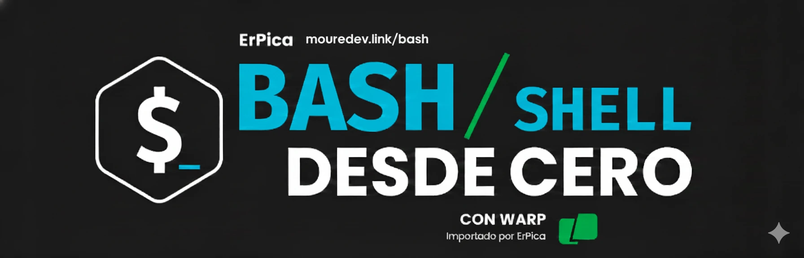

# Hola Bash Shell

## Curso de Brais Moure para aprender Bash, terminal y scripting para principiantes.

### Usaremos Warp, bash

[[Inicio 🔼](../README.md)] [[Siguiente lección ▶️](./01-FIRST-STEPS.md)]